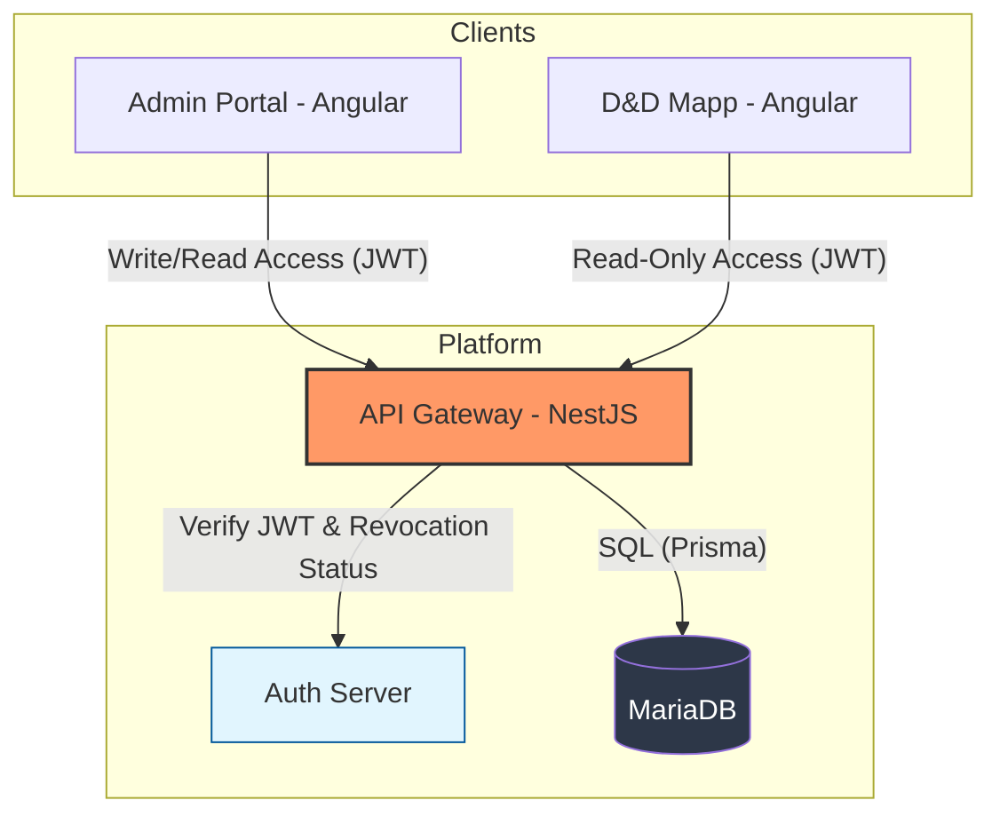

# D&D Mapp: API Gateway (`@dnd-mapp/api-gateway`)

[](https://github.com/dnd-mapp/api-gateway/actions/workflows/push-main.yaml)
[](./LICENSE)
[](https://github.com/prettier/prettier)
[](https://nestjs.com/)
[](https://www.prisma.io/)

> **OpenAPI Documentation**: [https://localhost.api.dndmapp.dev:4450/docs](https://localhost.api.dndmapp.dev:4450/docs) (Local Dev)

## Project Overview

The **D&D Mapp: API Gateway** is a high-performance, standalone REST API designed to serve as the "Source of Truth" for Tabletop RPG data. It provides structured access to core 5th Edition game mechanics, including Spells, Creature Stat Blocks, Races, Items, and Classes.

While built as a foundational component for the **D&D Mapp** platform, this service is architected to operate independently. This approach successfully decouples static rulebook data (SRD) from dynamic, player-specific campaign data, ensuring a clear separation of concerns and a focused data model.

### System Architecture

The following diagram illustrates how the API Gateway fits into the broader D&D Mapp ecosystem:



## Technical Stack

- **Framework:** [NestJS](https://nestjs.com/) with the [Fastify](https://www.fastify.io/) adapter for high-throughput, low-latency request handling.
- **Database:** [MariaDB](https://mariadb.org/) for robust relational data storage.
- **ORM:** [Prisma](https://www.prisma.io/) to ensure end-to-end type safety and efficient schema management.
- **Authentication:** JWT-based verification. The Gateway communicates with the **Auth Server** to validate tokens and ensure they have not been revoked.
- **Validation & Transformation:**
    - [class-validator](https://github.com/typestack/class-validator) for declarative, decorator-based validation of DTOs and environment variables.
    - [class-transformer](https://github.com/typestack/class-transformer) for proper casting and serialization of plain objects into class instances.
- **API Pattern:** RESTful architecture featuring built-in Pagination, Filtering (e.g., by Challenge Rating, Spell Level), and Sorting.

## Project Structure

The project follows a modular NestJS architecture, emphasizing separation between transport layers (DTOs), business logic, and data persistence.

```text
.
├── .docker/                            # Docker configuration (MariaDB, health checks)
├── prisma/                             # Prisma schema, migrations, and seed scripts
├── src/
│   ├── app/
│   │   ├── common/                     # Shared decorators, filters, interceptors, and pipes
│   │   ├── config/                     # Environment variable validation and configuration logic
│   │   ├── <feature>/                  # Feature-based modules (Spells, Creatures, etc.)
│   │   │   ├── dto/                    # Request / Response Data Transfer Objects (class-validator)
│   │   │   ├── entities/               # Domain entities / models
│   │   │   ├── controllers/
│   │   │   ├── services/
│   │   │   └── <feature>.module.ts
│   │   └── app.module.ts               # Main application container
│   └── main.ts                         # Entry point (Fastify setup, Swagger, HTTPS)
├── .tool-versions                      # Mise runtime configurations
└── package.json                        # Dependencies and scripts
```

## Key Features

- **SRD-Compliant Data:** A curated library of 5th Edition content, strictly adhering to the System Reference Document (SRD) for public consumption.
- **Strict Data Integrity:** Uses `class-validator` and `class-transformer` to enforce strict validation rules on all incoming Request Bodies, Query Parameters, and even the system's own Environment Variables at startup.
- **Administrative Data Management:** Includes a protected administrative layer for data entry and curation, allowing for seamless updates via a dedicated portal.
- **Decoupled Architecture:** By excluding player-specific data (characters, inventories, maps), the API remains a focused, highly cacheable reference engine.
- **Schema-First Design:** Leveraging Prisma and NestJS to provide a strictly typed contract, ensuring that complex game mechanics are represented with high data integrity.

---

## Getting Started

Follow these steps to set up your local development environment.

### 1. Prerequisites

We recommend using **[Mise-en-place (mise)](https://mise.jdx.dev/)** to manage runtimes and package managers. This project includes a `.tool-versions` file to ensure consistency.

- **Mise**: To handle Node.js and pnpm versions automatically.
- **Database**: MariaDB 10.11+
- **Docker**: For containerized development infrastructure.
- **mkcert**: For local TLS/SSL development (Optional but recommended).

### 2. Installation & Runtime Setup

Clone the repository and prepare your environment:

```bash
# Clone the repository
git clone https://github.com/dnd-mapp/api-gateway.git
cd api-gateway

# Install correct Node.js and pnpm versions (via Mise)
mise install

# Install dependencies
pnpm install
```

### 3. Local Networking & Security

The gateway is configured to run on a custom local domain with HTTPS.

#### A. Configure Local DNS

Update your system's hosts file to map the development domain to your local machine.

- **Windows (Admin):** `C:\Windows\System32\drivers\etc\hosts`
- **macOS / Linux:** `/etc/hosts`

Add the following line:

```text
127.0.0.1  localhost.api.dndmapp.dev
```

#### B. Generate Local SSL Certificates

Use `mkcert` to generate a self-signed certificate for the local domain:

```bash
# Install the CA to your trust store (once per machine)
mkcert -install

# Generate certificates for the local development domain
pnpm gen:ssl-cert
```

### 4. Infrastructure & Environment

#### A. Configure Environment Variables

Copy the template and adjust credentials if necessary.

```bash
cp .env.template .env
```

> [!IMPORTANT]
> This application performs **Environment Validation** on startup. If required variables are missing or have invalid formats (e.g., an invalid URL or a string where a number is expected), the application will log a validation error and fail to start. This is powered by `class-validator`.

#### B. Start the Database

Use the provided Docker Compose configuration to start a MariaDB instance. This container includes health checks and automatically prepares the required databases.

```bash
docker compose -f .docker/compose.yaml up -d
```

### 5. Database Initialization

Synchronize the Prisma schema and populate the database with SRD content.

> [!NOTE] **Why a Shadow Database?**  
> Prisma uses a temporary "Shadow Database" during development to detect schema drift and generate migrations without affecting your primary data. This is handled automatically by the MariaDB container. [Learn more](https://www.prisma.io/docs/orm/prisma-migrate/understanding-prisma-migrate/shadow-database).

```bash
# Run migrations to initialize the schema
pnpm prisma:migrate-dev

# Seed the database with core SRD data
pnpm prisma:seed
```

### 6. Launch the Application

Start the NestJS application in development mode:

```bash
pnpm start
```

Once running, the interactive **Swagger (OpenAPI 3.0)** documentation is available at: [https://localhost.api.dndmapp.dev:4450/docs](https://localhost.api.dndmapp.dev:4450/docs)

---

## Available Scripts

The following scripts are available via `pnpm`:

### Development & Build

- `pnpm gen:ssl-cert`: Generates local SSL certificates.
- `pnpm build`: Compiles the application into the `dist` folder.
- `pnpm start`: Launches the application.

### Database & ORM (Prisma)

- `pnpm prisma:migrate-dev`: Runs migrations in development mode.
- `pnpm prisma:migrate-deploy`: Applies pending migrations (CI/CD/Prod).
- `pnpm prisma:migrate-reset`: Resets the database and reapplies all migrations.
- `pnpm prisma:seed`: Populates the database with initial SRD data.
- `pnpm prisma:generate`: Generates the Prisma Client.

### Docker Operations

- `pnpm docker:build`: Builds the production Docker image.
- `pnpm docker:compose:up`: Starts MariaDB and the API in detached mode.
- `pnpm docker:compose:down`: Stops and removes the Docker containers.

### Code Quality

- `pnpm lint`: Runs ESLint check.
- `pnpm format:check`: Checks formatting via Prettier.
- `pnpm format:write`: Automatically fixes formatting and organizes imports.

---

## Docker Support

### Building the Image

To build the Docker image locally:

```bash
pnpm docker:build
```

### Running the Container

Ensure you pass the required environment variables:

```bash
docker run -p 4450:4450 --env-file .env dnd-mapp/api-gateway
```

---

## Configuration

The application is strictly configured via environment variables. Every variable is validated using `class-validator` decorators to ensure the runtime environment meets all safety requirements.

| Variable        | Description                       | Requirement    | Default                     |
|-----------------|-----------------------------------|----------------|-----------------------------|
| `DB_PASS`       | Database password                 | Required       | `pass`                      |
| `DB_NAME`       | Database/Schema name              | Required       | `dma_api_dev`               |
| `SSL_KEY_PATH`  | Path to the private key           | Required       | `./ssl-key.pem`             |
| `SSL_CERT_PATH` | Path to the certificate           | Required       | `./ssl-cert.pem`            |
| `DB_PORT`       | MariaDB port                      | Optional       | `3306`                      |
| `DB_HOST`       | MariaDB host address              | Optional       | `localhost`                 |
| `DB_USER`       | Database username                 | Optional       | `root`                      |
| `DATABASE_URL`  | Interpolated connection string    | Auto-generated | (Constructed)               |
| `HOST`          | The hostname the gateway binds to | Optional       | `localhost.api.dndmapp.dev` |
| `PORT`          | The port the gateway listens on   | Optional       | `4450`                      |
| `CORS_ORIGINS`  | Comma-separated allowed origins   | Optional       | `*`                         |

---

## Usage & Validation

The API Gateway provides a predictable REST interface. All endpoints use **Global Validation Pipes** to sanitize and validate input.

### Request Validation

Incoming requests (Body, Query, and Params) are transformed into typed DTOs. If a request fails validation (e.g., passing a string for an integer `limit`), the API will automatically respond with a `400 Bad Request` and a detailed error payload.

### Example: Fetching Spells

`class-transformer` handles the conversion of query string numbers into actual TypeScript `number` types.

```http
GET /v1/spells?level=3&school=Evocation&limit=10
```

### Example: Fetching a Creature Stat Block

```http
GET /v1/creatures/ancient-red-dragon
```

---

## Contributing

We welcome contributions! For detailed instructions on workflow, standards, and pull requests, please refer to [CONTRIBUTING.md](./CONTRIBUTING.md).

## License

This project is currently **unlicensed**. All rights are reserved. See the [LICENSE](./LICENSE) file for more information.

> [!Note]
> This project provides data covered under the Open Game License (OGL) v1.0a. Please refer to the `OGL.md` file in the root directory for specific attribution and compliance details.

## Contact / Support

- **Lead Maintainer**: NoNamer777
- **Issue Tracker**: [GitHub Issues](https://github.com/dnd-mapp/api-gateway/issues)
