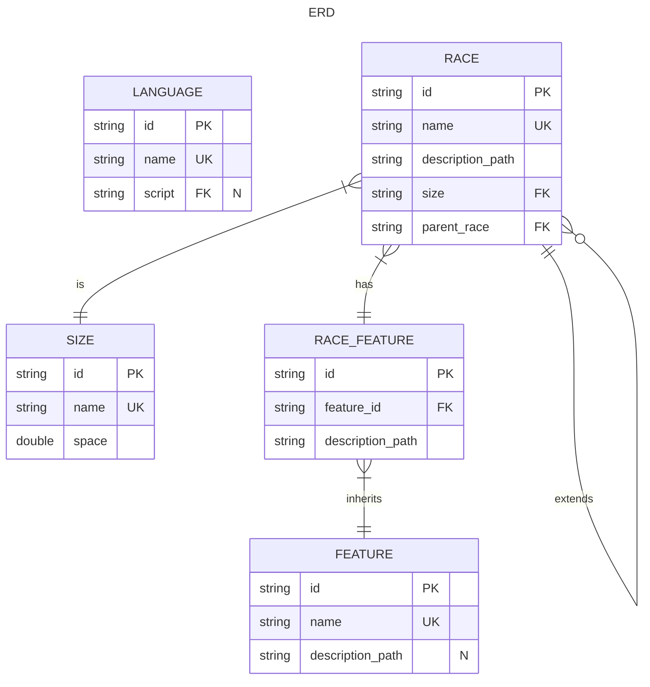

# ERD

```mermaid
---
title: ERD
---

erDiagram    
    LANGUAGE {
        string  id                  PK
        string  name                UK
        string  script              FK "N"
    }
    
    SIZE {
        string  id                  PK
        string  name                UK
        double  space
    }
    
    RACE {
        string  id                  PK
        string  name                UK
        string  description_path
        string  size                FK
        string  parent_race         FK
    }
    
    FEATURE {
        string  id                  PK
        string  name                UK
        string  description_path        "N"
    }
    
    RACE_FEATURE {
        string  id                  PK
        string  feature_id          FK
        string  description_path
    }
    
    RACE            }|--|| RACE_FEATURE : has
    RACE_FEATURE    }|--|| FEATURE      : inherits
    
    RACE            }|--|| SIZE         : is
    
    RACE            ||--o{ RACE         : extends
```
